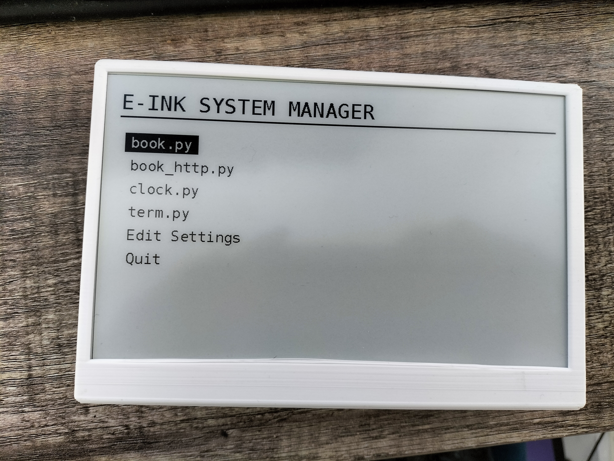
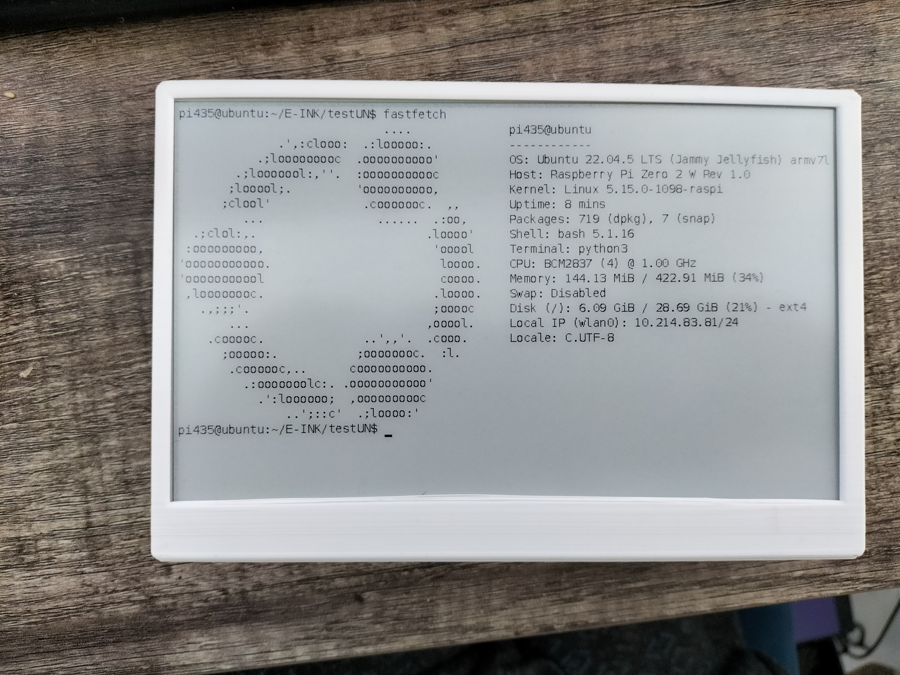
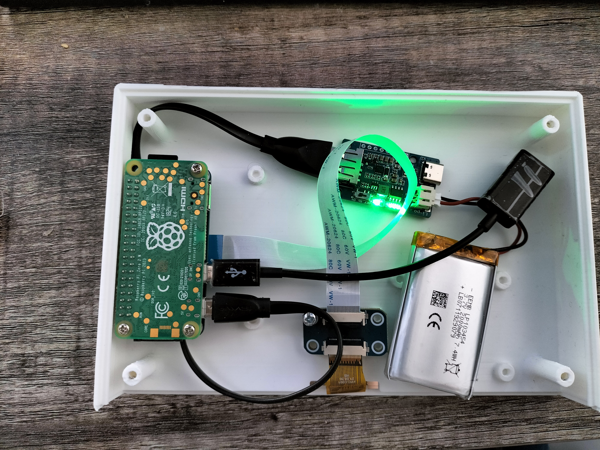

# Pi E-Ink System Manager

A portable, battery-powered E-Ink dashboard, terminal, and e-reader powered by a Raspberry Pi Zero 2 W and a Waveshare 7.5" display. 

This project features a custom-built menu system that dynamically loads modular apps, supports fast/partial screen refreshes, includes a Chrome extension for pushing web articles directly to the screen, and features a built-in desktop emulator for development without hardware.

## 📸 Showcase

| System Menu | Terminal (`fastfetch`) | Hardware Internals |
| :---: | :---: | :---: |
|  |  |  |

## 🛠️ Hardware Build

Inside the custom case, the system is powered by:
* **Raspberry Pi Zero 2 W**
* **Waveshare 800x480 7.5-inch E-INK** (V2)
* **EEMB Lithium Polymer Battery** (3.7V, 2000mAh)
* **LiPo Rider Plus** Fast Charger with USB-C

## 🎮 Control Methods

The system relies on standard keyboard inputs (handling ANSI escape sequences) and can be controlled in three ways:
1. **Headless / SSH:** Connect via SSH from another machine and run `python menu.py`.
2. **Bluetooth Keyboard:** Pair a wireless keyboard directly to the Pi.
3. **USB Keyboard:** Connect via a Micro-USB OTG adapter.

## 🖥️ Desktop Emulator (No Hardware Required!)

Don't have the physical E-Ink screen plugged in? Want to develop apps for this system on your Mac, Windows, or Linux desktop? 

If `menu.py` cannot detect the Waveshare drivers, it will automatically fall back to **Window Emulator Mode**. A UI window will pop up to act as your "screen" while you press keys in the terminal.

* **Realistic Mode:** Open `epd_emulator.py` and set `REALISTIC_EMULATION = True`. This perfectly mimics physical E-Ink behavior: matte grey/charcoal contrast, negative-color flashes for full refreshes to clear ink capsules, 5% ghosting artifacts on partial refreshes, and hardware SPI delays.
* **Instant Mode:** Set `REALISTIC_EMULATION = False` for zero-latency, pure B&W updates while coding.

*(Note: The emulator requires Python's built-in Tkinter. On some Linux distros, you may need to install it via `sudo apt install python3-tk python3-pil.imagetk`)*

## 📦 Included Apps

### 1. Main Menu (`menu.py`)
The core system manager. It automatically scans the directory for `.py` scripts and provides a UI to launch them. 
* **Hotkeys:** `W`/`S` or `Up`/`Down` to navigate, `Enter` to select, `R` to toggle Fast/Normal E-Ink refresh modes.
* **Settings Editor:** Includes a built-in text editor to modify configuration variables inside the other Python scripts without leaving the E-ink interface.

### 2. Terminal Emulator (`term.py`)
A fully functional Linux terminal right on the E-ink display, built using `pyte` and `pty`.
* Works as terminal.

### 3. Advanced Reader (`book.py`)
An E-book reader supporting `.txt` and `.fb2` formats. 
* **Features:** Progress tracking (saves state automatically), fast rendering via partial updates.
* **Controls:** 
  * `D` / `Right Arrow`: Next Page
  * `A` / `Left Arrow`: Previous Page
  * `/`: Search for text
  * `J`: Jump to percentage (%)
  * `T`: Set an auto-turn timer (seconds)
  * `Q`: Quit

### 4. Web Snippet Receiver (`book_http.py`)
Turns your E-ink display into a wireless reading screen for your desktop browser. 
* Launches a local HTTP server on port `8080`.
* Listens for text payloads and renders them instantly on the screen using a dedicated E-ink reading layout.

### 5. System Dashboard (`clock.py`)
A precision dashboard showing live system metrics.
* Displays Time, Date, Local IP Address, CPU usage (%), RAM usage (%), and CPU Temperature.

---

## 🌐 Chrome Extension Setup (E-Ink Sender Pro)

To use `book_http.py`, install the included Chrome extension on your main PC:

1. Open `manifest.json` and `background.js` in a text editor.
2. In `background.js`, locate the `sendToEink` function and change the IP address to match your Raspberry Pi's local IP:
```javascript
   const targetUrl = "http://YOUR_PI_IP_HERE:8080/receive";

```

3. Open Chrome and navigate to `chrome://extensions/`.
4. Enable **Developer mode** (top right).
5. Click **Load unpacked** and select the folder containing the extension files.
6. **Usage:**
* Highlight text on any website, right-click, and select **"📤 Send selected text to E-Ink"**.
* Or, click the extension icon in the toolbar to scrape and send the entire page.


## ⚙️ Installation & Dependencies

Requires Python 3. The Waveshare E-Paper drivers and all required libraries can be installed automatically via `pip`.

Ensure SPI and I2C are enabled on your Raspberry Pi via `sudo raspi-config`.

**1. Install all dependencies:**

```bash
pip install -r requirements.txt

```

*(Note: This will automatically pull the official `waveshare-epd` package directly from Waveshare's GitHub, along with `RPi.GPIO`, `spidev`, `pillow`, `psutil`, and `pyte`.)*

**2. Start the system:**

```bash
python3 menu.py

```
